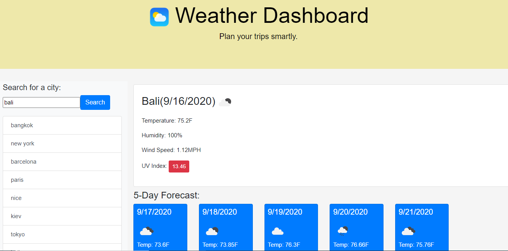

# Awesome-weather-dashboard

I created my awesome weatehr dashboard by using API and Ajax, local storage and bootstrap/JS/Juery. 

1. I started the project by creating HTML structure page first, then logic/weather.JS, and style.css sheets.
2. There were 3 main parts - form inputs, today and future forecast. There were 2 click events that we need to listen to - search button and historical list. 
3. Once user click search, we call createRow and getWeather function 
    - getWeather function: we check local storage first if any previous history. If not, we can make a new Ajax request and we call createRow function to create historical list.  
    - Once the request comes back, we can plug in the data into its HTML/div/card elements. 

4. getForcast function
    - we make another API/Ajax call to get data on 5-day forecast. Loop over all forecasts by 3-hour increments as shown in its documentation.

5. getuvIndex function
    - we make another API/Ajax call to get UV index data based on the first API call of logtitude and latitude. 
    - we define UV var and color for different levelo of UV safety.

The following image demonstrates the application functionality:

